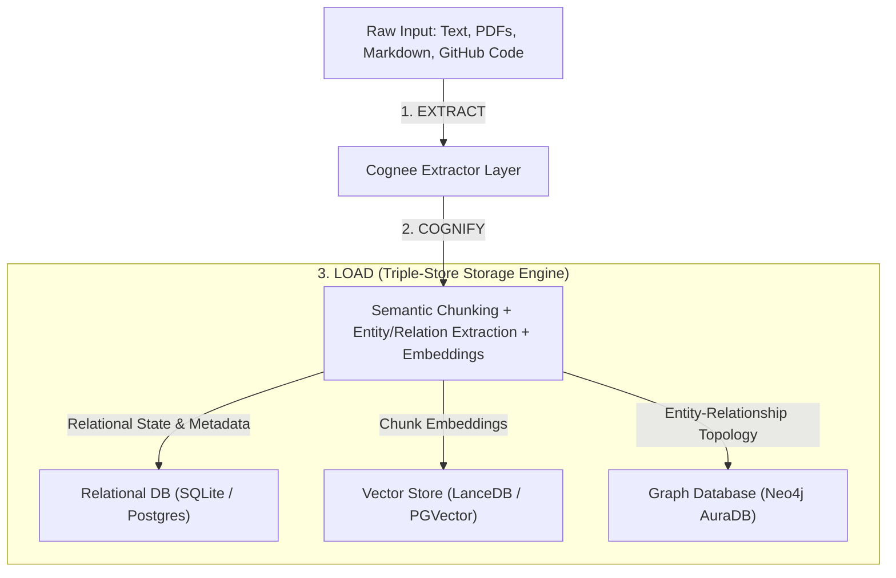

# 📚 Enterprise Setup & Architecture Blueprint: Cognitive AI Memory Systems with Cognee, Neo4j & Render Workflows

> **Enterprise Hackathon Reference Document**  
> Synthesized from the official **Enterprise Cognitive Architecture Blueprint**, covering the **Extract-Cognify-Load (ECL)** design pattern, **Neo4j AuraDB** graph integration, **Render Workflows** serverless task orchestration, production edge-case bugfixes, and real-world project archetypes.

---

## 📑 Table of Contents

1. [Executive Summary & Architectural Synergy](#1-executive-summary--architectural-synergy)
2. [Triple-Store Memory Tier (The ECL Pattern)](#2-triple-store-memory-tier-the-ecl-pattern)
3. [Neo4j AuraDB: Setup, Cypher & Python Driver](#3-neo4j-auradb-setup-cypher--python-driver)
4. [Cognee Engine Configuration & Production Runtime Tuning](#4-cognee-engine-configuration--production-runtime-tuning)
5. [Render Workflows: Distributed Serverless Task Execution](#5-render-workflows-distributed-serverless-task-execution)
6. [4 High-Impact Project Archetypes](#6-4-high-impact-project-archetypes)
7. [Production Declarative Blueprint (`render.yaml`)](#7-production-declarative-blueprint-renderyaml)
8. [End-to-End Memory Validation Script](#8-end-to-end-memory-validation-script)
9. [Critical Bug Fixes & Edge Cases (Must Read!)](#9-critical-bug-fixes--edge-cases-must-read)

---

# 1. Executive Summary & Architectural Synergy

Modern AI applications are shifting from stateless prompt-response loops to **persistent, multi-agent cognitive systems** requiring long-term memory across extended sessions.

### The Three Core Components:

1. **Neo4j AuraDB**: Fully managed, native graph database serving as the persistent structural topology for relational facts, entities, and conceptual dependencies. Enables high-performance graph traversals for complex multi-hop reasoning.
2. **Cognee**: Open-source AI memory engine operating on an **Extract-Cognify-Load (ECL)** design pattern. Converts unstructured data (documents, code, chats) into interconnected knowledge graphs paired with vector search.
3. **Render Workflows**: Serverless distributed execution engine designed for long-running, multi-step backend operations, multi-agent orchestration, and batch data processing (scales to zero when idle, guarantees execution for up to 24 hours).

### Key Architectural Advantages:

- **Hallucination Reduction**: Standard RAG relies solely on vector similarity, missing multi-hop relationships. Cognee constructs deterministically queryable graphs in Neo4j alongside vector indices for grounded hybrid retrievals.
- **Concurrency & No File-Locks**: Local file-based graph engines (like Kuzu) suffer from file-lock contention (`Could not set lock on file`) under parallel worker loads. Routing Cognee to hosted Neo4j AuraDB eliminates lock contention.
- **Compute Decoupling**: Heavy entity extraction (taking 60–180s) is offloaded to Render Workflows ephemeral workers, preventing user-facing HTTP 504 gateway timeouts.

---

# 2. Triple-Store Memory Tier (The ECL Pattern)

Cognee separates memory ingestion into 3 distinct runtime phases:



1. **Extract**: Ingests raw data from strings, local files, PDFs, databases, or remote GitHub repositories.
2. **Cognify**: Splits content into semantically coherent chunks, identifies core domain entities, extracts typed relationships via LLM, and computes vector embeddings.
3. **Load**: Persists structured data across three complementary stores:
   - **Relational DB** (SQLite / Postgres): Tracks application state, datasets, user access control, and metadata.
   - **Vector DB** (LanceDB / PGVector): Stores chunk embeddings for similarity search.
   - **Graph DB** (Neo4j): Stores entity-relationship topologies for multi-hop graph retrieval.

---

# 3. Neo4j AuraDB: Setup, Cypher & Python Driver

### Provisioning AuraDB Free Tier:

1. Console: Go to [console.neo4j.io](https://console.neo4j.io/) and choose **AuraDB Free**.
2. Create Database: Choose a blank database and name it (e.g., `cognee-agent-memory`).
3. Credentials: Save the downloaded credentials text file immediately (contains password and URI).
4. Protocol: Connects via Bolt with TLS: `neo4j+s://<instance-id>.databases.neo4j.io`.

### Native Python Driver Integration (`neo4j>=5.18.0`):

```python
import os
from neo4j import GraphDatabase, RoutingControl

NEO4J_URI = os.getenv("GRAPH_DATABASE_URL", "neo4j+s://xxxxxx.databases.neo4j.io")
NEO4J_USER = os.getenv("GRAPH_DATABASE_USERNAME", "neo4j")
NEO4J_PASSWORD = os.getenv("GRAPH_DATABASE_PASSWORD", "your-password")

class Neo4jClient:
    def __init__(self, uri, auth):
        self.driver = GraphDatabase.driver(uri, auth=auth)

    def close(self):
        self.driver.close()

    def verify_connectivity(self):
        self.driver.verify_connectivity()
        print("✅ Successfully connected to Neo4j AuraDB.")

    def add_entity_relationship(self, source_name: str, target_name: str, rel_type: str):
        query = (
            f"MERGE (a:Entity {{name: $source_name}}) "
            f"MERGE (b:Entity {{name: $target_name}}) "
            f"MERGE (a)-[r:{rel_type}]->(b) "
            f"RETURN a.name, type(r), b.name"
        )
        records, summary, keys = self.driver.execute_query(
            query,
            source_name=source_name,
            target_name=target_name,
            database_="neo4j",
            routing_=RoutingControl.WRITE,
        )
        return records

if __name__ == "__main__":
    client = Neo4jClient(NEO4J_URI, (NEO4J_USER, NEO4J_PASSWORD))
    client.verify_connectivity()
    client.add_entity_relationship("Agent_Alpha", "Neo4j_Graph", "MAINTAINS")
    client.close()
```

---

# 4. Cognee Engine Configuration & Production Runtime Tuning

### Required Dependencies (`requirements.txt`):

```txt
cognee[neo4j]>=1.5.4
neo4j>=5.18.0
render-sdk>=0.1.0
fastapi>=0.110.0
uvicorn>=0.28.0
pydantic>=2.6.0
python-dotenv>=1.0.1
```

### Complete `.env` Specification:

```env
# Primary LLM & Embedding (Compatible with OpenAI or NVIDIA NIM)
LLM_PROVIDER="openai"
LLM_MODEL="gpt-4o-mini"
LLM_API_KEY="your-api-key-here"
# If using NVIDIA NIM:
# LLM_BASE_URL="https://integrate.api.nvidia.com/v1"
# LLM_MODEL="nvidia/nemotron-3.5-lightning-30b-a3b"

EMBEDDING_PROVIDER="openai"
EMBEDDING_MODEL="text-embedding-3-small"
EMBEDDING_API_KEY="your-api-key-here"

# Application State Database (Relational)
DB_PROVIDER="sqlite"
DB_NAME="cognee_db"

# Vector Store Engine
VECTOR_DB_PROVIDER="lancedb"

# Graph Store Engine (Neo4j AuraDB Integration)
GRAPH_DATABASE_PROVIDER="neo4j"
GRAPH_DATABASE_URL="neo4j+s://xxxxxx.databases.neo4j.io"
GRAPH_DATABASE_USERNAME="neo4j"
GRAPH_DATABASE_PASSWORD="your-auradb-password"

# Multi-Tenancy & Dataset Handler (CRITICAL SETTING)
GRAPH_DATASET_DATABASE_HANDLER="neo4j_aura_dev"
ENABLE_BACKEND_ACCESS_CONTROL="false"

# Operational Performance Flags
CACHING="true"
AUTO_FEEDBACK="false"           # Set false in high-throughput hackathon demo to save tokens
DATASET_QUEUE_ENABLED="true"    # Enforces max 6 concurrent datasets to avoid lock leaks
```

### Framework Integrations Supported by Cognee:

- **LangGraph** (`cognee-integration-langgraph`): Graph-state persistence across multi-step node transitions.
- **CrewAI** (`cognee-integration-crewai`): Shared crew-level memory graphs across autonomous agent roles.
- **Claude Agent SDK** (`cognee-integration-claude`): Native tool-use hooks for persistent session memory.
- **Code Graph** (`SearchType.CODE`): Indexes entire GitHub repos into typed symbols/routes without using LLM tokens.

---

# 5. Render Workflows: Distributed Serverless Task Execution

### Compute Primitives Comparison on Render:

| Service Type          | Traffic Handling          | Lifecycle Model        | Scale-to-Zero     | Max Execution       | Primary Use Case                                         |
| :-------------------- | :------------------------ | :--------------------- | :---------------- | :------------------ | :------------------------------------------------------- |
| **Web Service**       | Inbound Public HTTP       | Continuous             | No                | Continuous          | APIs, Dashboards, Webhooks                               |
| **Background Worker** | Internal Queue Polling    | Continuous             | No                | Continuous          | Celery / BullMQ workers                                  |
| **Cron Job**          | None (Scheduled)          | Ephemeral              | Yes               | 12 Hours            | Scheduled DB sync, Nightly cleanup                       |
| **Render Workflow**   | **Triggered via SDK/API** | **On-Demand Task Run** | **Yes (in secs)** | **24 Hours / Task** | **Distributed ETL, Cognee Ingestion, Multi-Agent Loops** |

### Defining & Triggering Render Workflows:

#### Task Definition (`workflow_tasks.py`):

```python
import asyncio
from render import Render
import cognee

render_client = Render()

async def process_document_memory_task(document_url: str, dataset_name: str):
    """
    Long-running background task executed on Render Workflows.
    Ingests text, builds knowledge graph in Neo4j, updates vector store.
    """
    print(f"Starting memory ingestion task for dataset: {dataset_name}")

    # Extract & Cognify into Neo4j
    await cognee.add(document_url, dataset_name=dataset_name)
    await cognee.cognify(dataset_name=dataset_name)

    # Test query to confirm graph indexing
    search_results = await cognee.search(
        query_text="What are the key entities?",
        dataset_name=dataset_name
    )
    print(f"✅ Ingestion complete. Extracted {len(search_results)} primary nodes.")
    return {
        "status": "SUCCESS",
        "dataset": dataset_name,
        "entities_processed": len(search_results)
    }
```

#### Triggering Non-Blockingly from Web API (`trigger_app.py`):

```python
from render import Render
render = Render()

def handle_user_upload(file_url: str, user_id: str):
    # Triggers background task without blocking web thread
    started_run = render.workflows.start_task(
        "agent-memory-pipeline/process_document_memory_task",
        [file_url, f"user_dataset_{user_id}"]
    )
    print(f"Dispatched task to Render Workflows. Run ID: {started_run.id}")
    return {"message": "Processing started in background", "run_id": started_run.id}
```

---

# 6. 4 High-Impact Project Archetypes

These are the 4 official architectural archetypes outlined for this stack:

### 1. 🛡️ Autonomous Multi-Agent Software Auditor

- **Flow**: User submits GitHub repo URL -> Render Workflow clones repository -> Calls Cognee's GitHub code-graph connector (`SearchType.CODE`) to map symbols, dependencies, and storage calls in Neo4j **without using LLM tokens**.
- **Query**: Specialized agents run Cypher queries to detect circular dependencies, security vulnerabilities, and dead code paths across entire repos.

### 2. 🌐 Continuous Enterprise Knowledge Graph (ETL)

- **Flow**: Connectors poll Notion, Google Drive, and Slack on a schedule -> Render Workflows manages parallel ingestion tasks routing data into Cognee's ECL pipeline -> Entities mapped to centralized Neo4j database.
- **Value**: Prevents knowledge fragmentation across disconnected SaaS tools.

### 3. 💬 Adaptive Customer Support System with Long-Term User Memory

- **Flow**: Fast vector search serves instant responses -> Background Render Workflow reads conversation history, extracts user preferences/decisions, and updates user node in Neo4j.
- **Value**: Agents recall multi-month customer context, past tickets, and preference changes.

### 4. ⚖️ Regulatory & Legal Document Graph Analyzer

- **Flow**: Ingests 200+ page contracts and regulatory frameworks -> Render Workflows processes documents in parallel -> Cognee extracts legal clauses, entities, and cross-references in Neo4j.
- **Query**: Run multi-hop queries: _"Find all sub-clauses affected by regulatory updates in Section 4"_.

---

# 7. Production Declarative Blueprint (`render.yaml`)

This specification defines the multi-service topology for Cognee + Neo4j + Render Workflows:

```yaml
services:
  # 1. User-Facing Web API (FastAPI / Express)
  - type: web
    name: agent-memory-api
    runtime: python
    plan: starter
    buildCommand: 'pip install -r requirements.txt'
    startCommand: 'uvicorn server:app --host 0.0.0.0 --port $PORT'
    envVars:
      - key: PYTHON_VERSION
        value: '3.11.8'
      - key: ENVIRONMENT
        value: production
      - fromGroup: cognee-neo4j-credentials

  # 2. Distributed Task Execution Tier (Render Workflows)
  - type: workflow
    name: agent-memory-pipeline
    runtime: python
    plan: flex
    buildCommand: 'pip install -r requirements.txt'
    envVars:
      - key: PYTHON_VERSION
        value: '3.11.8'
      - key: DATASET_QUEUE_ENABLED
        value: 'true'
      - fromGroup: cognee-neo4j-credentials

# Shared Environment Variable Group
envVarGroups:
  - name: cognee-neo4j-credentials
    envVars:
      - key: LLM_PROVIDER
        value: 'openai'
      - key: LLM_MODEL
        value: 'gpt-4o-mini'
      - key: LLM_API_KEY
        sync: false
      - key: EMBEDDING_PROVIDER
        value: 'openai'
      - key: EMBEDDING_MODEL
        value: 'text-embedding-3-small'
      - key: EMBEDDING_API_KEY
        sync: false
      - key: GRAPH_DATABASE_PROVIDER
        value: 'neo4j'
      - key: GRAPH_DATABASE_URL
        sync: false # e.g. neo4j+s://xxxxxx.databases.neo4j.io
      - key: GRAPH_DATABASE_USERNAME
        value: 'neo4j'
      - key: GRAPH_DATABASE_PASSWORD
        sync: false
      - key: GRAPH_DATASET_DATABASE_HANDLER
        value: 'neo4j_aura_dev'
      - key: ENABLE_BACKEND_ACCESS_CONTROL
        value: 'false'
```

---

# 8. End-to-End Memory Validation Script

Save this as `scripts/test_memory.py` to test your pipeline:

```python
import os
import asyncio
from dotenv import load_dotenv

# Load environment variables prior to importing cognee
load_dotenv(override=True)

import cognee
from cognee.modules.search.types import SearchType

async def run_agent_memory_validation():
    print("=========================================================")
    print(" Initializing Cognee + Neo4j Agent Memory Pipeline ")
    print("=========================================================")

    # Step 1: Wipe local state to guarantee clean context
    print("\n[Step 1] Resetting local system state...")
    await cognee.forget(everything=True)

    # Step 2: Define unstructured domain context
    sample_domain_knowledge = (
        "Project Orion is managed by Engineer Sarah. "
        "The project relies on a Neo4j database deployed on AuraDB. "
        "Render Workflows handle background task orchestration for Project Orion. "
        "Cognee provides memory abstraction, converting raw documents into knowledge graphs."
    )

    # Step 3: Ingest knowledge into memory store
    print("\n[Step 2] Ingesting unstructured knowledge into memory store...")
    await cognee.add(sample_domain_knowledge, dataset_name="orion_project_memory")

    # Step 4: Run Cognify pipeline (Extracts entities & loads Neo4j graph)
    print("\n[Step 3] Running Cognify pipeline (Extracting entities & building Neo4j graph)...")
    await cognee.cognify(dataset_name="orion_project_memory")
    print("✅ Cognify complete. Subgraph successfully loaded into Neo4j!")

    # Step 5: Perform Hybrid Retrieval Query
    print("\n[Step 4] Querying Memory Layer via Auto-Routing Search...")
    query_string = "How is Project Orion orchestrated and stored?"
    search_results = await cognee.search(
        query_text=query_string,
        dataset_name="orion_project_memory"
    )

    print(f"\nSearch Query: '{query_string}'")
    print("---------------------------------------------------------")
    for idx, result in enumerate(search_results, 1):
        print(f"Result [{idx}]: {result}")

    print("\n=========================================================")
    print(" Memory Pipeline Validation Successfully Completed ")
    print("=========================================================")

if __name__ == "__main__":
    asyncio.run(run_agent_memory_validation())
```

---

# 9. Critical Bug Fixes & Edge Cases (Must Read!)

### 🚨 1. Pydantic Environment Variable Mapping Bug (Cognee Issue #2697):

- **Symptom**: When setting `ENABLE_BACKEND_ACCESS_CONTROL=true` with Neo4j, Cognee crashes with:
  `OSError: The selected graph dataset to database handler does not work with the configured graph database provider`.
- **Root Cause**: Pydantic expects `GRAPH_DATASET_DATABASE_HANDLER` rather than legacy conventions.
- **Fix**: You **MUST** explicitly set in `.env`:
  ```env
  GRAPH_DATASET_DATABASE_HANDLER="neo4j_aura_dev"
  # Or "neo4j_community" for self-hosted
  ```

### 🚨 2. Local Kuzu Lock Contention under Parallel Task Load:

- **Symptom**: `Could not set lock on file` error when running multiple workers locally.
- **Fix**: Routing graph operations to **Neo4j AuraDB completely eliminates file-lock contention**. For local debugging without Neo4j, set:
  ```env
  SUBPROCESS_OPEN_LOCK_RETRIES=5
  SUBPROCESS_IDLE_TTL_SECONDS=0
  ```

### 🚨 3. GitHub App OAuth State Timeouts:

- Cognee's GitHub integration uses a signed state parameter that expires after **10 minutes**.
- GitHub webhooks require public HTTPS; use **ngrok** for local testing.

### 🚨 4. Blueprint Validation on Render:

- Before pushing changes to `render.yaml`, validate locally using Render CLI:
  ```bash
  render blueprints validate
  ```
