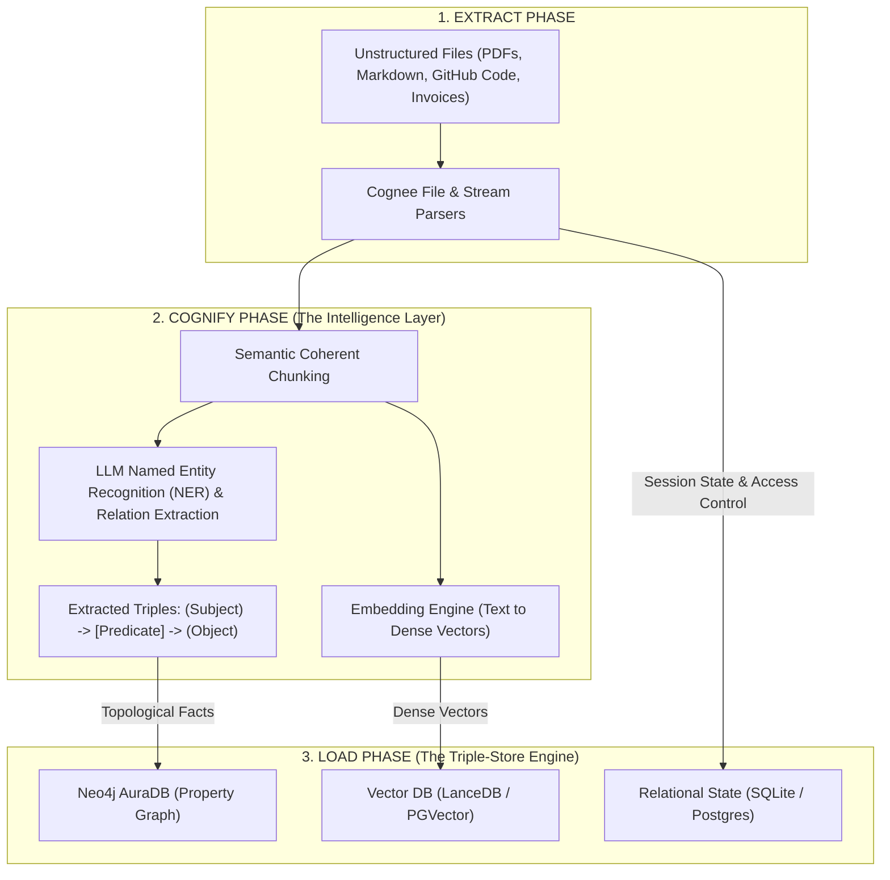

# 📚 Master Encyclopedia: Neo4j, Cognee & Render Workflows (Deep Technical Architecture)

> **Enterprise Hackathon Knowledge Base & Deep Architecture Guide**  
> This document goes beyond surface-level setup. It analyzes the internal mechanics, algorithmic data structures, custom schemas, graph traversal mathematics, distributed execution lifecycles, and edge-case resolutions for **Neo4j AuraDB**, **Cognee**, and **Render Workflows**.

---

## 🧭 Deep-Dive Navigation

1. [Core Architecture & The ECL (Extract-Cognify-Load) Engine](#1-core-architecture--the-ecl-extract-cognify-load-engine)
2. [Neo4j Deep Internals: Data Modeling, Constraints & Graph Vector Indexing](#2-neo4j-deep-internals-data-modeling-constraints--graph-vector-indexing)
3. [Advanced Cypher Query Engineering for GraphRAG](#3-advanced-cypher-query-engineering-for-graphrag)
4. [Cognee Internal Mechanics: Custom Pydantic Models & Ontologies](#4-cognee-internal-mechanics-custom-pydantic-models--ontologies)
5. [Cognee Search Types & Hybrid Retrieval Engine](#5-cognee-search-types--hybrid-retrieval-engine)
6. [Render Workflows: Distributed Execution Model & Task Lifecycle](#6-render-workflows-distributed-execution-model--task-lifecycle)
7. [The Master Architecture: End-to-End Code Implementation](#7-the-master-architecture-end-to-end-code-implementation)
8. [Production Deployment Blueprint (`render.yaml`)](#8-production-deployment-blueprint-renderyaml)
9. [4 Production Project Archetypes (Step-by-Step Implementation)](#9-4-production-project-archetypes-step-by-step-implementation)
10. [Troubleshooting & Known Community Edge Cases](#10-troubleshooting--known-community-edge-cases)

---

# 1. Core Architecture & The ECL (Extract-Cognify-Load) Engine

Modern multi-agent systems fail when relying solely on traditional Vector RAG because vector search only measures **semantic cosine proximity**, completely missing **topological connectivity**.

### Mathematical Comparison: Vector RAG vs. GraphRAG

$$\text{Vector Similarity: } \cos(\theta) = \frac{\mathbf{u} \cdot \mathbf{v}}{\|\mathbf{u}\| \|\mathbf{v}\|}$$
_Measures whether two text snippets sound similar, but cannot answer: "How is A connected to D via B and C?"_

$$\text{Graph Traversal: } \text{Path}(A \to D) = (A) \xrightarrow{r_1} (B) \xrightarrow{r_2} (C) \xrightarrow{r_3} (D)$$
_Follows physical, verified relational dependencies without hallucination._



---

# 2. Neo4j Deep Internals: Data Modeling, Constraints & Graph Vector Indexing

Neo4j is built on a **Labeled Property Graph (LPG)** model. Every node has an ID, one or more Labels, and key-value properties. Relationships are first-class citizens with explicit direction and properties.

### Property Modeling Rules of Thumb (Crucial for Hackathons)

1. **When to make an attribute a Property vs. a Node**:
   - **Property**: If it is a scalar value only relevant to that single entity (e.g. `person.age = 28`, `transaction.amount = 4500`).
   - **Node**: If multiple entities share it and you want to traverse through it (e.g. `City`, `Company`, `Skill`, `IP_Address`, `Enzyme`).
     - _Anti-Pattern_: `(:Person {city: "Delhi"})` -> Cannot easily do graph clustering on Delhi.
     - _Best-Practice_: `(:Person)-[:LIVES_IN]->(:City {name: "Delhi"})` -> Instantly enables community detection!

### Schema Constraints & Vector Indexing in Neo4j 5.x

Before ingesting data, create uniqueness constraints and vector indexes to prevent duplicates and enable native vector search inside Cypher:

```cypher
// 1. Uniqueness Constraint (Ensures deterministic entity merging)
CREATE CONSTRAINT entity_id_unique IF NOT EXISTS
FOR (e:Entity) REQUIRE e.id IS UNIQUE;

// 2. Composite Index for fast property lookup
CREATE INDEX entity_name_idx IF NOT EXISTS
FOR (e:Entity) ON (e.name);

// 3. Native Neo4j Vector Index (Combines Graph + Vector in a single query!)
CREATE VECTOR INDEX `entity_embeddings` IF NOT EXISTS
FOR (n:Entity) ON (n.embedding)
OPTIONS {indexConfig: {
 `vector.dimensions`: 1536,
 `vector.similarity_function`: 'cosine'
}};
```

---

# 3. Advanced Cypher Query Engineering for GraphRAG

Do not use simple `MATCH (n) RETURN n` queries. For hackathon demos, use advanced multi-hop algorithms:

### 1. Multi-Hop Shortest Path (Fraud & Dependency Tracing)

Finds the exact chain of connections between two entities regardless of depth:

```cypher
MATCH (source:Entity {name: $sourceName}), (target:Entity {name: $targetName})
MATCH path = shortestPath((source)-[*1..6]-(target))
RETURN path, length(path) AS hops;
```

### 2. Native Hybrid GraphRAG Query (Vector Search + 2-Hop Graph Expansion)

Uses Neo4j's vector index to find semantically relevant seed nodes, then traverses outgoing edges to assemble deep contextual graph memory:

```cypher
CALL db.index.vector.queryNodes('entity_embeddings', 5, $queryEmbedding)
YIELD node, score
MATCH (node)-[r]->(neighbor:Entity)
RETURN
  node.name AS SeedEntity,
  score AS VectorSimilarity,
  type(r) AS Relationship,
  neighbor.name AS ConnectedFact
ORDER BY score DESC;
```

### 3. Circular Dependency / Fraud Loop Detection (Length 3 to 5)

Detects circular transactions or architectural circular dependencies:

```cypher
MATCH path = (origin:Entity)-[:TRANSFERRED_TO*3..5]->(origin)
RETURN
  [n in nodes(path) | n.name] AS CycleNodes,
  length(path) AS CycleLength
LIMIT 10;
```

### 4. Graph Hubs & Centrality (Identify the Key Influencers)

Finds the top 5 most critical hub nodes by relationship degree:

```cypher
MATCH (n:Entity)-[r]-()
RETURN n.name AS Entity, labels(n)[0] AS Type, count(r) AS Degree
ORDER BY Degree DESC
LIMIT 5;
```

---

# 4. Cognee Internal Mechanics: Custom Pydantic Models & Ontologies

By default, Cognee extracts generic entities. To build a **winning, domain-specific project**, you can define custom **Pydantic DataModels inheriting from `DataPoint`**.

### Defining Domain-Specific Knowledge Graphs in Cognee

```python
from cognee.shared.data_models import DataPoint
from typing import List, Optional, Any
from pydantic import Field

# Domain Model 1: Healthcare / Pharma Example
class Drug(DataPoint):
    name: str
    mechanism_of_action: str
    metadata: dict = {
        "index_fields": ["name", "mechanism_of_action"],
        "identity_fields": ["name"]
    }

class ClinicalTrial(DataPoint):
    trial_id: str
    phase: str
    tested_drug: Drug
    adverse_effects: List[str]
    metadata: dict = {
        "index_fields": ["trial_id", "adverse_effects"],
        "identity_fields": ["trial_id"]
    }

# Domain Model 2: Financial Fraud / Shell Company Example
class BankAccount(DataPoint):
    account_number: str
    bank_name: str
    jurisdiction: str
    metadata: dict = {
        "index_fields": ["account_number", "bank_name"],
        "identity_fields": ["account_number"]
    }

class CorporateEntity(DataPoint):
    company_name: str
    registration_country: str
    beneficial_owner: str
    accounts: List[BankAccount]
    metadata: dict = {
        "index_fields": ["company_name", "beneficial_owner"],
        "identity_fields": ["company_name"]
    }
```

### Feeding Data Directly to Knowledge Graph without LLM Token Waste

If you already have semi-structured data (JSON/CSV), use Cognee's direct data injection:

```python
import cognee
import asyncio

async def inject_structured_entities():
    account = BankAccount(
        account_number="CH-9948271",
        bank_name="CreditZurich",
        jurisdiction="Switzerland"
    )
    company = CorporateEntity(
        company_name="Apex Holdings LLC",
        registration_country="Panama",
        beneficial_owner="Vikram Malhotra",
        accounts=[account]
    )

    # Directly commits instances to Neo4j with relationships
    await cognee.add([company])
    await cognee.cognify()
```

---

# 5. Cognee Search Types & Hybrid Retrieval Engine

Cognee provides specialized search types tailored to different agent retrieval tasks:

| Search Type                   | Target Layer        | Execution Mechanism                                                    | Ideal Use Case                                    |
| :---------------------------- | :------------------ | :--------------------------------------------------------------------- | :------------------------------------------------ |
| `SearchType.GRAPH_COMPLETION` | Graph DB (Neo4j)    | Traverses graph relationships & uses LLM to synthesize connected paths | Complex multi-hop queries, relationship reasoning |
| `SearchType.SIMILARITY`       | Vector DB (LanceDB) | Cosine similarity on dense chunk embeddings                            | Raw fact retrieval, keyword matching              |
| `SearchType.HYBRID`           | Graph + Vector      | Vector seeds + Graph traversal expansion                               | Complete domain questions, chat agents            |
| `SearchType.CODE`             | Code-Graph          | Deterministic AST symbol/module dependency tree (Zero LLMs!)           | Codebase auditing, refactoring analysis           |

### Code Implementation:

```python
from cognee.modules.search.types import SearchType
import cognee

async def query_with_exact_strategy(user_query: str):
    # 1. Multi-hop Reasoning via Graph Completion
    graph_context = await cognee.search(
        SearchType.GRAPH_COMPLETION,
        query_text=user_query,
        dataset_name="hackathon_dataset"
    )

    # 2. Raw Semantic Similarity
    vector_context = await cognee.search(
        SearchType.SIMILARITY,
        query_text=user_query,
        dataset_name="hackathon_dataset"
    )

    return {"graph": graph_context, "vector": vector_context}
```

---

# 6. Render Workflows: Distributed Execution Model & Task Lifecycle

Render Workflows runs your tasks as **durable, cloud-native jobs**.

```
[Trigger API Call]
       │
       ▼
[Render Enqueues Task] ──► [Ephemeral Container Provisions (2-5s)]
                                      │
                                      ▼
                        [Task Executes (Up to 24 Hours)]
                                      │
                         ┌────────────┴────────────┐
                         ▼                         ▼
                 [Success: Result]         [Failure: Auto-Retry]
                         │                         │
                         ▼                         ▼
             [Deprovisions (Scale to 0)]   [Exponential Backoff]
```

### Key SDK Rules:

1. **Always pass `TaskContext` (`ctx`) as the first argument**:
   ```python
   @app.task
   def my_task(ctx: TaskContext, data: dict):
       # ctx allows invoking subtasks or accessing run ID
       pass
   ```
2. **Fan-Out / Fan-In Parallel Processing**:
   ```python
   @app.task
   def parallel_ingest_orchestrator(ctx: TaskContext, document_urls: list):
       # Dispatches all tasks concurrently across isolated worker containers
       task_handles = [ctx.run(process_single_doc_task, url) for url in document_urls]
       return {"dispatched_jobs": len(task_handles)}
   ```
3. **Execution Limits**: Up to 24 hours per task execution.
4. **Billing**: Exact second of active container execution. Scales to zero automatically when idle.

---

# 7. The Master Architecture: End-to-End Code Implementation

Here is the complete Python backend service exposing FastAPI endpoints for Cognee + Render Workflows + Neo4j:

### `src/server.py` (FastAPI Service):

```python
from fastapi import FastAPI, BackgroundTasks, HTTPException
from pydantic import BaseModel
import cognee
import os
from dotenv import load_dotenv

load_dotenv(override=True)

app = FastAPI(title="Cognitive Memory Engine", version="1.0.0")

class IngestRequest(BaseModel):
    content: str
    dataset_name: str = "default_memory"

class QueryRequest(BaseModel):
    question: str
    dataset_name: str = "default_memory"

@app.get("/health")
def health():
    return {
        "status": "healthy",
        "graph_provider": os.getenv("GRAPH_DATABASE_PROVIDER", "neo4j"),
        "vector_provider": os.getenv("VECTOR_DB_PROVIDER", "lancedb")
    }

@app.post("/api/memory/ingest")
async def ingest_memory(payload: IngestRequest, background_tasks: BackgroundTasks):
    """
    Ingests text and runs Cognify in background to avoid HTTP timeouts
    """
    async def run_cognify():
        await cognee.add(payload.content, dataset_name=payload.dataset_name)
        await cognee.cognify(dataset_name=payload.dataset_name)
        print(f"✅ Cognify completed for dataset: {payload.dataset_name}")

    background_tasks.add_task(run_cognify)
    return {"success": True, "message": "Ingestion and Cognify started in background"}

@app.post("/api/memory/query")
async def query_memory(payload: QueryRequest):
    try:
        results = await cognee.search(
            query_text=payload.question,
            dataset_name=payload.dataset_name
        )
        return {"success": True, "results": results}
    except Exception as e:
        raise HTTPException(status_code=500, detail=str(e))
```

---

# 8. Production Deployment Blueprint (`render.yaml`)

Use this `render.yaml` specification in your repository root to deploy the entire multi-tier system on Render:

```yaml
services:
  # 1. User-Facing Web API (FastAPI)
  - type: web
    name: agent-memory-api
    runtime: python
    plan: starter
    buildCommand: 'pip install -r requirements.txt'
    startCommand: 'uvicorn src.server:app --host 0.0.0.0 --port $PORT'
    envVars:
      - key: PYTHON_VERSION
        value: '3.11.8'
      - key: ENVIRONMENT
        value: production
      - fromGroup: cognee-neo4j-credentials

  # 2. Distributed Task Execution Tier (Render Workflows)
  - type: workflow
    name: agent-memory-pipeline
    runtime: python
    plan: flex
    buildCommand: 'pip install -r requirements.txt'
    envVars:
      - key: PYTHON_VERSION
        value: '3.11.8'
      - key: DATASET_QUEUE_ENABLED
        value: 'true'
      - fromGroup: cognee-neo4j-credentials

# Shared Environment Variable Group
envVarGroups:
  - name: cognee-neo4j-credentials
    envVars:
      - key: LLM_PROVIDER
        value: 'openai'
      - key: LLM_MODEL
        value: 'nvidia/nemotron-3.5-lightning-30b-a3b'
      - key: LLM_BASE_URL
        value: 'https://integrate.api.nvidia.com/v1'
      - key: LLM_API_KEY
        sync: false
      - key: EMBEDDING_PROVIDER
        value: 'openai'
      - key: EMBEDDING_MODEL
        value: 'text-embedding-3-small'
      - key: EMBEDDING_API_KEY
        sync: false
      - key: GRAPH_DATABASE_PROVIDER
        value: 'neo4j'
      - key: GRAPH_DATABASE_URL
        sync: false # e.g., neo4j+s://xxxxxx.databases.neo4j.io
      - key: GRAPH_DATABASE_USERNAME
        value: 'neo4j'
      - key: GRAPH_DATABASE_PASSWORD
        sync: false
      - key: GRAPH_DATASET_DATABASE_HANDLER
        value: 'neo4j_aura_dev'
      - key: ENABLE_BACKEND_ACCESS_CONTROL
        value: 'false'
```

---

# 9. 4 Production Project Archetypes (Step-by-Step Implementation)

### 🥇 Archetype 1: Autonomous Multi-Agent Software Auditor

- **What it does**: Clones a repository, builds a deterministic Code-Graph using AST parsers (zero LLM token consumption!), and uses Cypher to catch security issues.
- **Key Cypher**:
  ```cypher
  // Detect routes that access database without passing through authentication middleware
  MATCH (route:Route)-[:CALLS]->(db:DatabaseCall)
  WHERE NOT (route)-[:USES_MIDDLEWARE]->(:AuthMiddleware)
  RETURN route.path, db.query;
  ```

### 🥈 Archetype 2: Continuous Enterprise Knowledge Graph (ETL)

- **What it does**: Periodic Render Workflow polls Notion / Slack / Google Drive -> routes updates to Cognee ECL pipeline -> unifies knowledge in central Neo4j AuraDB.
- **Key Advantage**: Prevents enterprise memory loss across disconnected SaaS tools.

### 🥉 Archetype 3: Adaptive Customer Support with Long-Term Memory

- **What it does**: Vector similarity answers FAQs in milliseconds. Simultaneously, a Render Workflow extracts user sentiment, intent, and recurring issues into the customer's Neo4j node.
- **Key Cypher**:
  ```cypher
  MATCH (c:Customer {id: $customerId})-[:FILED_TICKET]->(t:Ticket)-[:RELATED_TO]->(p:Product)
  RETURN p.name, count(t) AS complaintCount;
  ```

### 🏅 Archetype 4: Regulatory & Legal Document Graph Analyzer

- **What it does**: Ingests legal acts and compliance guidelines (200+ pages). Extracts clauses, amendments, and cross-references.
- **Key Cypher**:
  ```cypher
  MATCH (amendment:Clause {id: "SEC-104"})-[:AMENDS|SUPERSEDES]->(target:Clause)
  RETURN target.id, target.summary;
  ```

---

# 10. Troubleshooting & Known Community Edge Cases

### ⚠️ Bug 1: Pydantic Settings Error (Cognee Issue #2697)

- **Error**: `OSError: The selected graph dataset to database handler does not work with the configured graph database provider`.
- **Cause**: Pydantic expects `GRAPH_DATASET_DATABASE_HANDLER` instead of legacy variable names.
- **Fix**: Set in `.env`:
  ```env
  GRAPH_DATASET_DATABASE_HANDLER="neo4j_aura_dev"
  ```

### ⚠️ Bug 2: File Lock Error in Kuzu (`Could not set lock on file`)

- **Cause**: Multiple worker threads accessing local file-based graph storage concurrently.
- **Fix**: Use hosted **Neo4j AuraDB**, which supports full concurrent multi-client connections. If debugging locally, set:
  ```env
  SUBPROCESS_OPEN_LOCK_RETRIES=5
  SUBPROCESS_IDLE_TTL_SECONDS=0
  ```

### ⚠️ Bug 3: Rate Limiting on LLM Extraction

- **Cause**: Extracting entities from hundreds of chunks can exhaust API rate limits.
- **Fix**: Use our **NVIDIA 5-Key Auto-Rotation Pool** (`aiService.js`), which rotates keys and retries automatically on HTTP 429.
