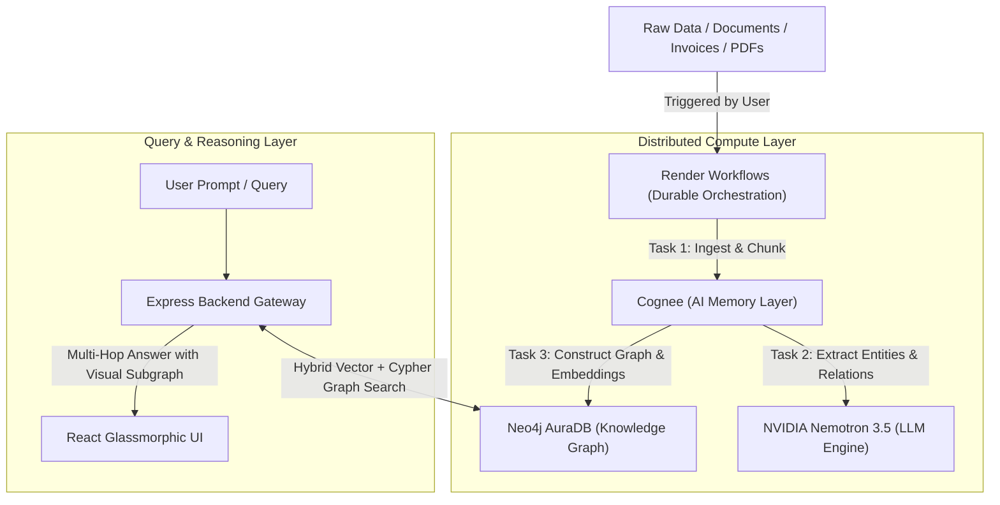

# 📚 The Master Blueprint: Neo4j + Cognee + Render Workflows

> **Hackathon Architecture Master Guide**  
> This comprehensive study guide provides a deep-dive analysis, complete technical reference, and production-grade implementation patterns for **Neo4j**, **Cognee**, and **Render Workflows**. Use this guide to maximize your team's velocity and build an industry-grade GraphRAG system during the hackathon.

---

## 🧭 Table of Contents

1. [The Triumvirate: Why These 3 Technologies?](#1-the-triumvirate-why-these-3-technologies)
2. [Deep Dive 1: Neo4j (The Knowledge Graph Core)](#2-deep-dive-1-neo4j-the-knowledge-graph-core)
3. [Deep Dive 2: Cognee (AI Memory & Graph-RAG Engine)](#3-deep-dive-2-cognee-ai-memory--graph-rag-engine)
4. [Deep Dive 3: Render Workflows (Distributed Durable Execution)](#4-deep-dive-3-render-workflows-distributed-durable-execution)
5. [End-to-End Master Pipeline (Code Implementation)](#5-end-to-end-master-pipeline-code-implementation)
6. [3 Winning Hackathon Project Architectures](#6-3-winning-hackathon-project-architectures)
7. [Cypher & Cognee Cheatsheet](#7-cypher--cognee-cheatsheet)

---

# 1. The Triumvirate: Why These 3 Technologies?

Modern Generative AI has hit the **"Context Wall"**:

- **Traditional Vector RAG Flaws**: Slices text into disconnected chunks. When asked multi-hop questions (_"Who is the ultimate beneficial owner of the shell company that received funds from Vendor X?"_), Vector RAG fails because relationships across paragraphs are lost.
- **Hallucinations**: Vector search only measures lexical/semantic proximity, not factual connection.

### How the Trio Solves This:



1. **Neo4j**: Acts as the single source of truth for **relationships**, entities, and interconnected nodes.
2. **Cognee**: Automates the pipeline of converting unstructured text into structured Knowledge Graphs and vector indexes.
3. **Render Workflows**: Prevents HTTP timeouts (which occur during 60-120s entity extraction) by running the pipeline as a scalable, durable background DAG.

---

# 2. Deep Dive 1: Neo4j (The Knowledge Graph Core)

Neo4j is the world's leading **Labeled Property Graph (LPG)** database.

### Core Concepts:

- **Node**: An entity (e.g., `(:Person)`, `(:Company)`, `(:Transaction)`, `(:Drug)`).
- **Label**: The category or type of the node.
- **Relationship (Edge)**: Directed connection between nodes (e.g., `-[:OWNS]->`, `-[:TRANSFERRED_FUNDS]->`, `-[:CAUSES_SYMPTOM]->`).
- **Properties**: Key-value pairs stored directly on nodes or relationships (e.g., `{ amount: 50000, timestamp: "2026-09-18" }`).

### Connecting to Neo4j AuraDB (Cloud):

Sign up at [neo4j.com/cloud/aura-free/](https://neo4j.com/cloud/aura-free/) to get your free managed instance.

#### Environment Variables (`.env`):

```env
NEO4J_URI=neo4j+s://<YOUR-INSTANCE-ID>.databases.neo4j.io
NEO4J_USERNAME=neo4j
NEO4J_PASSWORD=<YOUR-GENERATED-PASSWORD>
```

#### Node.js Connection Helper (`backend/neo4j.js`):

```javascript
import neo4j from 'neo4j-driver';

const driver = neo4j.driver(
  process.env.NEO4J_URI || 'neo4j+s://your-instance.databases.neo4j.io',
  neo4j.auth.basic(
    process.env.NEO4J_USERNAME || 'neo4j',
    process.env.NEO4J_PASSWORD || 'your-password'
  )
);

export async function runQuery(cypherQuery, params = {}) {
  const session = driver.session();
  try {
    const result = await session.run(cypherQuery, params);
    return result.records.map((record) => record.toObject());
  } finally {
    await session.close();
  }
}

export async function verifyConnection() {
  const serverInfo = await driver.getServerInfo();
  console.log('✅ Neo4j Connected:', serverInfo.address);
  return serverInfo;
}
```

#### Python Connection (`python/neo4j_client.py`):

```python
from neo4j import GraphDatabase
import os

URI = os.getenv("NEO4J_URI")
AUTH = (os.getenv("NEO4J_USERNAME", "neo4j"), os.getenv("NEO4J_PASSWORD"))

def execute_cypher(query, parameters=None):
    with GraphDatabase.driver(URI, auth=AUTH) as driver:
        with driver.session() as session:
            result = session.run(query, parameters or {})
            return [record.data() for record in result]
```

---

# 3. Deep Dive 2: Cognee (AI Memory & Graph-RAG Engine)

**Cognee** (`cognee.ai`) bridges the gap between LLMs and databases. It handles chunking, entity extraction, ontology mapping, vector embedding, and graph ingestion automatically.

### The 3 Core Operations:

1. **`cognee.add(data)`**: Accepts raw strings, files (PDFs, Markdown, TXT), or URLs.
2. **`cognee.cognify()`**:
   - Calls the LLM to identify entities and relationships.
   - Generates vector embeddings for semantic similarity.
   - Populates nodes and edges in Neo4j and vector embeddings in the vector index.
3. **`cognee.search(query_text)` / `cognee.recall()`**: Performs a hybrid traversal: searches relevant vector embeddings, traverses adjacent graph nodes, and returns contextual graph context to the LLM.

### Complete Cognee Setup with Neo4j & NVIDIA NIM:

#### 1. Installation:

```bash
pip install "cognee[neo4j]"
```

#### 2. Cognee Configuration (`.env`):

```env
# LLM Provider Configuration (Using NVIDIA Nemotron 3.5 30B)
LLM_PROVIDER=openai
LLM_API_KEY=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
LLM_BASE_URL=https://integrate.api.nvidia.com/v1
LLM_MODEL=nvidia/nemotron-3.5-lightning-30b-a3b

# Neo4j Graph Database Configuration
GRAPH_DATABASE_PROVIDER=neo4j
GRAPH_DATABASE_URL=neo4j+s://<YOUR-INSTANCE-ID>.databases.neo4j.io
GRAPH_DATABASE_USERNAME=neo4j
GRAPH_DATABASE_PASSWORD=<YOUR-AURA-PASSWORD>

# Vector Store (Defaults to LanceDB or Qdrant)
VECTOR_DB_PROVIDER=lancedb
```

#### 3. Python Pipeline Implementation (`worker/graph_pipeline.py`):

```python
import cognee
import asyncio
import os

async def build_knowledge_graph(document_text: str):
    print("📥 Ingesting document into Cognee...")
    # Step 1: Add unstructured text or file
    await cognee.add(document_text)

    print("🧠 Cognifying (Extracting entities & building Neo4j Graph)...")
    # Step 2: Cognify extracts nodes, relations and builds the graph
    await cognee.cognify()
    print("✅ Neo4j Knowledge Graph successfully constructed!")

async def ask_graph_memory(question: str):
    print(f"🔍 Searching Graph Memory for: {question}")
    # Step 3: Hybrid search over Graph + Vectors
    search_results = await cognee.search(question)
    return search_results

# Example Execution
if __name__ == "__main__":
    sample_data = """
    Dr. Maya Lin leads the Oncology Research Team at BioGenix Labs in Boston.
    BioGenix Labs developed the experimental kinase inhibitor compound 'BGX-901'.
    Clinical trials showed BGX-901 strongly inhibits the BRAF-V600E mutation.
    However, when combined with Warfarin, it significantly elevates blood plasma toxicity.
    """
    asyncio.run(build_knowledge_graph(sample_data))

    query = "What happens if a patient taking Warfarin is prescribed BGX-901?"
    results = asyncio.run(ask_graph_memory(query))
    for r in results:
        print("Result:", r)
```

---

# 4. Deep Dive 3: Render Workflows (Distributed Durable Execution)

**Render Workflows** (`render.com/workflows`) is Render's native code-first execution engine for compute-heavy, asynchronous, and multi-step background tasks.

### Why Render Workflows is Essential for Cognee:

- Calling `cognee.cognify()` on multiple documents or datasets takes between **30 to 180 seconds**.
- Standard web requests fail with HTTP 504 timeouts.
- Render Workflows executes these jobs outside your web server on isolated compute with **automatic retries, step checkpointing, and parallel fan-out**.

### Core Architecture:

- **`Workflows`**: The workflow application container.
- **`@app.task`**: Decorator that turns a standard function into a durable, retriable cloud task.
- **`TaskContext` (`ctx`)**: Automatically injected as the first argument. Allows spawning child tasks via `ctx.run()`, managing fan-out/fan-in parallel workers.

### Implementation with Python SDK (`workflows/data_pipeline.py`):

#### 1. Install SDK:

```bash
pip install render
```

#### 2. Workflow Script:

```python
from render import Workflows, TaskContext
import asyncio

app = Workflows()

@app.task
def extract_and_cognify_task(ctx: TaskContext, document_payload: dict):
    """
    Background durable task: Parses text and runs Cognee graph construction
    """
    doc_id = document_payload.get("id")
    content = document_payload.get("text")

    print(f"Executing background task for Doc #{doc_id}...")

    # Import inside task to keep cold-starts fast
    import cognee

    async def run_pipeline():
        await cognee.add(content)
        await cognee.cognify()

    asyncio.run(run_pipeline())

    return {
        "docId": doc_id,
        "status": "COMPLETED",
        "graphIndexed": True
    }

@app.task
def batch_document_workflow(ctx: TaskContext, document_list: list):
    """
    Orchestrator task: Distributes multiple documents across parallel workers (Fan-Out)
    """
    print(f"Dispatching {len(document_list)} documents across Render parallel compute...")

    # Fan-out: Execute task concurrently for each document
    results = []
    for doc in document_list:
        job = ctx.run(extract_and_cognify_task, doc)
        results.append(job)

    return {"totalBatched": len(results), "status": "ALL_TASKS_DISPATCHED"}
```

#### 3. Triggering from Web Server (Node.js or Python):

You can trigger a Render Workflow run via simple HTTP POST to the Render API using your Render API key:

```bash
POST https://api.render.com/v1/workflows/{workflow_id}/runs
Authorization: Bearer <RENDER_API_KEY>
Content-Type: application/json

{
  "task": "batch_document_workflow",
  "input": { "document_list": [...] }
}
```

---

# 5. End-to-End Master Pipeline (Code Implementation)

Here is how you expose this entire flow to your React frontend:

### Backend Express Route (`backend/server.js`):

```javascript
// Endpoint: Query Neo4j Graph directly for visual UI representation
app.get('/api/graph/explore', async (req, res) => {
  try {
    const cypher = `
      MATCH (n)-[r]->(m)
      RETURN 
        n.id AS sourceId, labels(n)[0] AS sourceType, n.name AS sourceName,
        type(r) AS relationType,
        m.id AS targetId, labels(m)[0] AS targetType, m.name AS targetName
      LIMIT 100
    `;
    const records = await runQuery(cypher);

    // Format nodes and edges for React visualizer
    const nodesMap = new Map();
    const edges = [];

    records.forEach((row) => {
      if (!nodesMap.has(row.sourceId)) {
        nodesMap.set(row.sourceId, {
          id: row.sourceId,
          label: row.sourceName,
          type: row.sourceType,
        });
      }
      if (!nodesMap.has(row.targetId)) {
        nodesMap.set(row.targetId, {
          id: row.targetId,
          label: row.targetName,
          type: row.targetType,
        });
      }
      edges.push({
        source: row.sourceId,
        target: row.targetId,
        label: row.relationType,
      });
    });

    res.json({
      success: true,
      nodes: Array.from(nodesMap.values()),
      edges,
    });
  } catch (err) {
    res.status(500).json({ success: false, error: err.message });
  }
});
```

---

# 6. 3 Winning Hackathon Project Architectures

### 🥇 Project 1: "FinDetective" — Financial Laundering & Shell Network Tracing

- **Dataset**: Panama Papers, synthetic wire transfer logs, company registration PDFs.
- **Workflow**:
  1. User uploads a zip file of 20 shell company transaction logs.
  2. **Render Workflow** parallelizes document extraction across 5 workers.
  3. **Cognee** maps accounts, directors, and banks in Neo4j.
  4. User runs: _"Find circular transactions between Director A and Beneficiary B"_.
  5. UI highlights the multi-hop fraud loop in glowing neon on the graph!

### 🥈 Project 2: "PharmaGraph AI" — Drug Discovery & Adverse Reaction Predictor

- **Dataset**: FDA drug labels, PubMed clinical papers, gene interaction reports.
- **Workflow**:
  1. Ingests research abstracts on kinase inhibitors and metabolic enzymes.
  2. **Cognee** builds: `(Compound) -[:INHIBITS]-> (Protein) -[:MUTATED_IN]-> (Disease)`.
  3. Doctor enters a patient's multi-drug prescription.
  4. The engine traverses the graph to catch lethal 3-hop interactions missed by standard vector RAG.

### 🥉 Project 3: "DevOps Root-Cause Detective" — Autonomous Incident Resolution

- **Dataset**: Kubernetes event logs, GitHub PR diffs, Slack incident channels, microservice dependency trees.
- **Workflow**:
  1. Real-time incident logs ingest via Webhook into **Render Workflows**.
  2. **Cognee** graphs: `(Commit_A) -[:INTRODUCED_BUG]-> (AuthService) -[:OVERLOADED]-> (Redis)`.
  3. LLM instantly reports the exact offending commit causing the outage.

---

# 7. Cypher & Cognee Cheatsheet

### 🔑 Essential Cypher Queries:

#### 1. Find all relationships connected to an entity:

```cypher
MATCH (p:Person {name: "Satvik"})-[r]-(target)
RETURN p, r, target
```

#### 2. Multi-hop Graph Traversal (Up to 3 degrees of separation):

```cypher
MATCH path = (source:Entity {name: "CompanyA"})-[*1..3]-(target:Entity {name: "BankB"})
RETURN path
LIMIT 10
```

#### 3. Shortest Path between two entities:

```cypher
MATCH (a:Person {name: "SuspectA"}), (b:Company {name: "OffshoreHoldings"})
MATCH path = shortestPath((a)-[*]-(b))
RETURN path
```

#### 4. Find High-Degree Hubs (Most connected entities):

```cypher
MATCH (n)-[r]-()
RETURN n.name, count(r) AS connections
ORDER BY connections DESC
LIMIT 10
```

---

### 🧠 Cognee API Methods Quick Reference:

| Method                            | Description                                                    |
| :-------------------------------- | :------------------------------------------------------------- |
| `await cognee.add(data)`          | Ingests raw string, filepath (`.pdf`, `.txt`), or web URL      |
| `await cognee.cognify()`          | Triggers LLM entity & relation extraction and builds the graph |
| `await cognee.search(query)`      | Executes hybrid Vector + Graph traversal and returns context   |
| `await cognee.prune.prune_data()` | Clears cache and database collections                          |

---

### 🛡️ Hackathon Velocity Pro-Tips:

1. **Never parse PDFs on the main web thread**: Always offload parsing to Render Workflows or background scripts.
2. **Keep entity types clear**: When prompting Cognee, specify entity classes (e.g. `Person, Organization, Transaction, Location`).
3. **Show, Don't Just Tell**: Judges are wowed by **Visual Graphs**. An interactive graph canvas showing nodes expanding in real-time wins hackathons 9 times out of 10!
